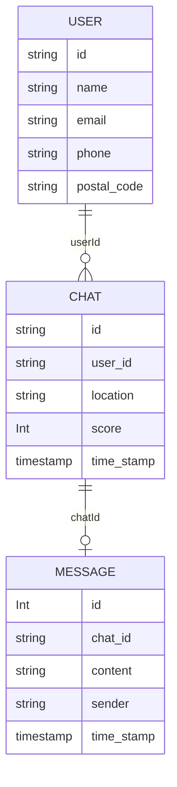

```mermaid
erDiagram
    USER ||--o{ CHAT : userId
    USER {
      string id
      string name
      string email
      string phone
      string postal_code
    }
    CHAT {
      string id
      string user_id
      string location
      Int score
      timestamp time_stamp
    }
    CHAT ||--o| MESSAGE : chatId
    MESSAGE {
      Int id
      string chat_id
      string content
      string sender
      timestamp time_stamp
    }
```
